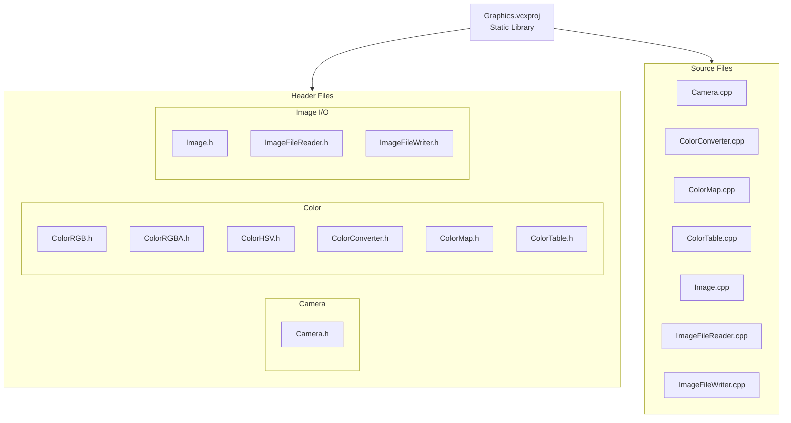

# Graphicsプロジェクト構成（Mermaid）

対象: `CGLib/Graphics/Graphics.vcxproj`

```mermaid
flowchart TB
    A["Graphics.vcxproj\nStatic Library"]

    subgraph H[Header Files]
        subgraph HC[Camera]
            HC1[Camera.h]
        end

        subgraph HColor[Color]
            HColor1[ColorRGB.h]
            HColor2[ColorRGBA.h]
            HColor3[ColorHSV.h]
            HColor4[ColorConverter.h]
            HColor5[ColorMap.h]
            HColor6[ColorTable.h]
        end

        subgraph HI[Image I/O]
            HI1[Image.h]
            HI2[ImageFileReader.h]
            HI3[ImageFileWriter.h]
        end
    end

    subgraph C[Source Files]
        C1[Camera.cpp]
        C2[ColorConverter.cpp]
        C3[ColorMap.cpp]
        C4[ColorTable.cpp]
        C5[Image.cpp]
        C6[ImageFileReader.cpp]
        C7[ImageFileWriter.cpp]
    end

    A --> H
    A --> C
```

## 補足
- この図は `Graphics.vcxproj` の `ClInclude` / `ClCompile` を基に作成しています。
- AI向けに `Camera` / `Color` / `Image I/O` の観点で整理しています。
