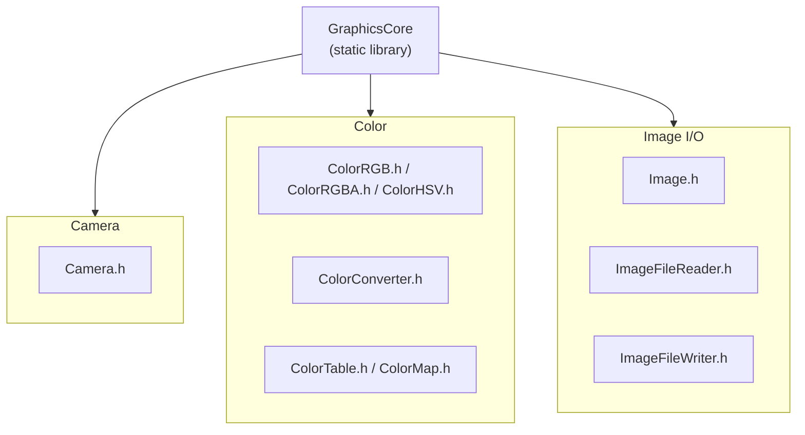

# Graphics Module — File Layout

The module uses the `Phantom::Graphics` namespace and provides cameras, color
spaces, and image I/O. It depends on `Math`. See
[`../docs/module-reference.md`](../docs/module-reference.md) for API details.

- `Camera` switches between perspective and orthographic projection and
  returns GLM-based matrices from `getViewMatrix()`, `getProjectionMatrix()`,
  and `getModelMatrix()`.
- `ImageFileReader` and `ImageFileWriter` use STB for 8-bit RGBA and HDR
  floating-point images.
- `ColorMap` provides linear value-to-color mapping with min/max normalization
  and color-table interpolation for scientific visualization.
