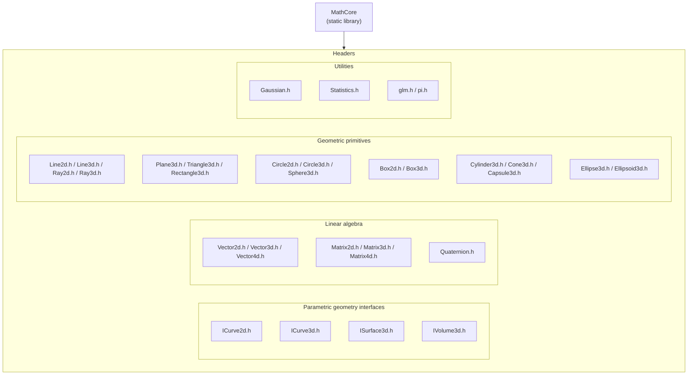

# Math Module — File Layout

The module uses the `Phantom::Math` namespace. Its types are thin GLM aliases
defined as `float` / `double` templates. See
[`../docs/module-reference.md`](../docs/module-reference.md) for API details.

- Each geometric primitive implements its corresponding interface, such as
  `ICurve3d<T>`, and provides `float` and `double` aliases such as `Line3df`
  and `Line3dd`.
- Operations are free functions such as `getLength`, `getDistance`, and
  `areSame`, rather than member functions. Use `glm::dot`, `glm::cross`, and
  `glm::normalize` directly.
