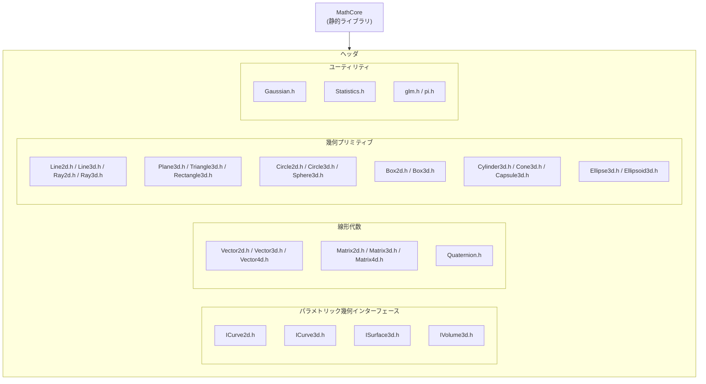

# Math モジュール — ファイル構成

`Phantom::Math` 名前空間。すべての型は GLM の薄いエイリアスで、`float` / `double` の
テンプレートとして定義される。API 詳細は [`../docs/module-reference.md`](../docs/module-reference.md) を参照。

- 各幾何プリミティブは対応するインターフェース（`ICurve3d<T>` など）を実装し、
  `float` / `double` 版のエイリアス（`Line3df` / `Line3dd` など）を持つ。
- 演算はメンバー関数ではなくフリー関数（`getLength`, `getDistance`, `areSame` など）。
  `glm::dot` / `glm::cross` / `glm::normalize` はそのまま利用する。
