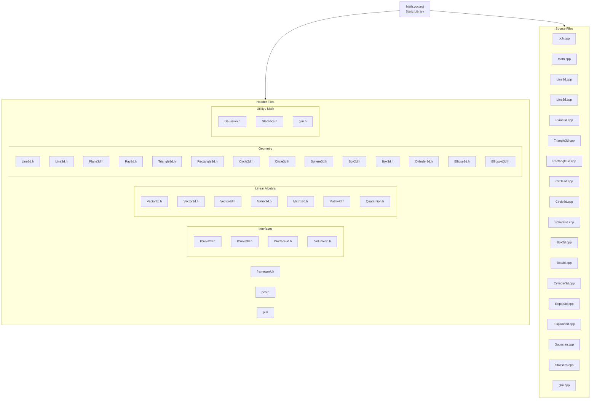

# Mathプロジェクト構成（Mermaid）

対象: `CGLib/Math/Math.vcxproj`

## 補足
- この図は `Math.vcxproj` の `ClInclude` / `ClCompile` を基に作成しています。
- AI向けの把握しやすさを優先して、`Interfaces` / `Linear Algebra` / `Geometry` / `Utility` に分類しています。
