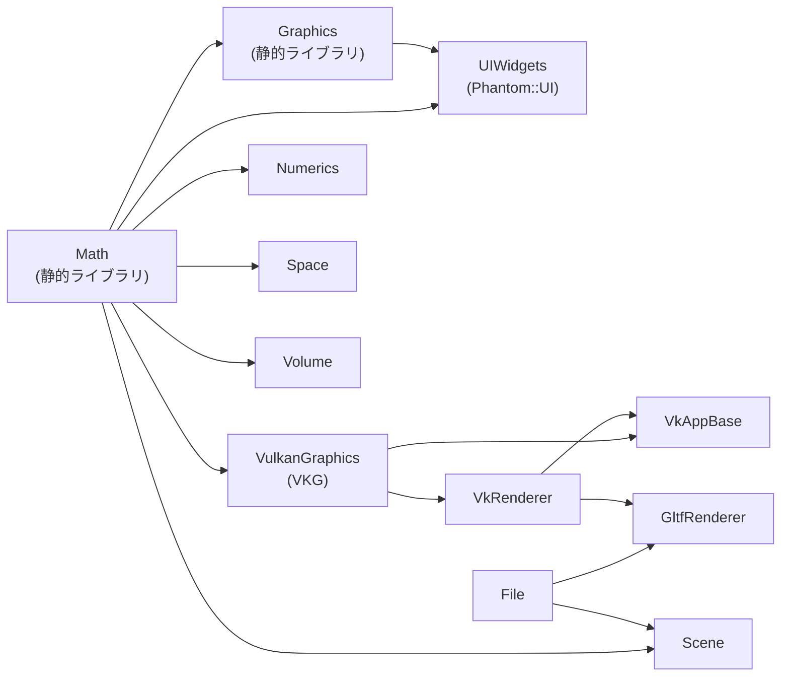
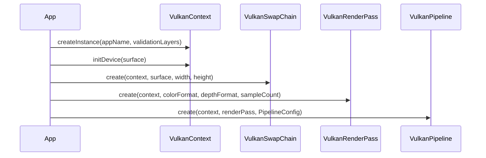

# CGLib — 内部仕様ドキュメント

Phantom プロジェクト共通グラフィクスライブラリ。  
Vulkan ベースのレンダリング基盤と、数学・画像処理・ImGui UI・シーングラフ・ファイル I/O・空間データ構造・
ボリューム処理を提供するスタティックライブラリ群。

> 2026-08-21、かつて別サブモジュールだったプロジェクト群を本リポジトリへフラットに
> 統合した。本ファイルは旧 `CGLib/README.md` とそのサブモジュールの README を
> 統合したもの — 以下「Math〜UIWidgets」までが従来の CGLib 由来、
> 「Scene〜GltfViewer」までが統合されたモジュール由来のセクション。

---

## モジュール構成とビルド依存関係



| モジュール | 名前空間 | 役割 |
|---|---|---|
| Math | `Phantom::Math` | ベクトル・行列・クォータニオン・幾何プリミティブ |
| Graphics | `Phantom::Graphics` | カメラ・色・画像 I/O |
| VulkanGraphics | `VKG` | Vulkan オブジェクト抽象化 |
| UIWidgets | `Phantom::UI` | ImGui ベースの UI フレームワーク |
| Numerics | `Phantom::Numerics` | Eigen による固有値・SVD 演算 |
| File | `Phantom::File` | OBJ / glTF / PLY / STL 読み書き |
| Space | `Phantom::Space` | 空間分割・交差・距離計算 |
| Volume | `Phantom::Volume` | スパースボリューム・Marching Cubes |
| Scene | `Phantom::Scene` | シーングラフ + Presenter パターン |
| VkRenderer | `VKG` | Vulkan サブレンダラー |
| VkAppBase | `VKG` | Vulkan アプリケーション基盤 |
| GltfRenderer | — | glTF シーン専用レンダラー |

---

## Math モジュール

**ファイル:** `CGLib/Math/` — `Phantom::Math` 名前空間

### 線形代数型

すべての型はテンプレート `<typename T>` で定義され、`float` / `double` のエイリアスを提供する。

| 型テンプレート | float 版 | double 版 | 内部表現 |
|---|---|---|---|
| `Vector2d<T>` | `Vector2df` | `Vector2dd` | `glm::vec2` |
| `Vector3d<T>` | `Vector3df` | `Vector3dd` | `glm::vec3` |
| `Vector4d<T>` | `Vector4df` | `Vector4dd` | `glm::vec4` |
| `Matrix2d<T>` | `Matrix2df` | `Matrix2dd` | `glm::mat2` |
| `Matrix3d<T>` | `Matrix3df` | `Matrix3dd` | `glm::mat3` |
| `Matrix4d<T>` | `Matrix4df` | `Matrix4dd` | `glm::mat4` |
| `Quaternion<T>` | `Quaternionf` | `Quaterniond` | `glm::quat` |

### パラメトリック幾何インターフェース

```
ICurve2d<T>          getPosition(u) → Vector2d<T>
ICurve3d<T>          getPosition(u) → Vector3d<T>
ISurface3d<T>        getPosition(u, v) → Vector3d<T>
IVolume3d<T>         getPosition(u, v, w) → Vector3d<T>
```

### 幾何プリミティブ

各クラスは対応するインターフェースを継承し、`float` / `double` 版のエイリアスを持つ。

| クラス | 継承 | 主要メンバ |
|---|---|---|
| `Line2d<T>` | `ICurve2d<T>` | origin, direction |
| `Line3d<T>` | `ICurve3d<T>` | origin, direction |
| `Ray2d<T>` | — | origin, direction |
| `Ray3d<T>` | — | origin, direction |
| `Plane3d<T>` | `ISurface3d<T>` | normal, d |
| `Triangle3d<T>` | `ISurface3d<T>` | v0, v1, v2 |
| `Rectangle3d<T>` | `ISurface3d<T>` | origin, u, v |
| `Circle2d<T>` | `ICurve2d<T>` | center, radius |
| `Circle3d<T>` | `ICurve3d<T>` | center, normal, radius |
| `Sphere3d<T>` | `ISurface3d<T>` | center, radius |
| `Box2d<T>` | — | min, max |
| `Box3d<T>` | `IVolume3d<T>` | min, max |
| `Cylinder3d<T>` | `ISurface3d<T>` | center, axis, radius, height |
| `Ellipse3d<T>` | `ISurface3d<T>` | center, u, v (半径ベクトル) |
| `Ellipsoid3d<T>` | `IVolume3d<T>` | center, radii |

### ユーティリティ

| ファイル | 内容 |
|---|---|
| `Gaussian.h / .cpp` | 正規分布 PDF / CDF |
| `Statistics.h / .cpp` | 平均・分散・標準偏差 |
| `glm.h / glm.cpp` | GLM インクルード集約ヘッダ |
| `pi.h` | 円周率定数 |

---

## Graphics モジュール

**ファイル:** `CGLib/Graphics/` — `Phantom::Graphics` 名前空間

### Camera

```cpp
class Camera {
    // ビュー行列・モデル行列・プロジェクション行列の管理
    // 透視投影 (perspective) と正射影 (orthographic) を切替
    Matrix4df getViewMatrix() const;
    Matrix4df getProjectionMatrix() const;
    Matrix4df getModelMatrix() const;
};
```

### 色表現

| クラス | 説明 |
|---|---|
| `ColorRGB<T>` | `glm::vec<3,T>` ベース。`ColorRGBf`(float) / `ColorRGBuc`(uint8) |
| `ColorRGBA<T>` | `glm::vec<4,T>` ベース |
| `ColorHSV` | H/S/V プロパティを持つ HSV 色 |

### 色変換・マッピング

| クラス | 説明 |
|---|---|
| `ColorConverter` | HSV ↔ RGB 変換静的メソッド |
| `ColorTable` | 色パレット（`createJetTable()` ファクトリ付き） |
| `ColorMap` | 値 → 色の線形マッピング（min/max 正規化 + カラーテーブル補間） |

### 画像

```cpp
template <typename T>
class Image {
    int width, height;
    std::vector<T> pixels;   // RGBA順, T = uint8 or float
    T& operator()(int x, int y, int ch);
};
```

| クラス | 説明 |
|---|---|
| `ImageFileReader` | STB 経由で 8bit RGBA / HDR float 画像を読み込む |
| `ImageFileWriter` | STB 経由で 8bit RGBA 画像を書き出す |

---

## Shader モジュール（OpenGL）— **廃止**

> **注意:** OpenGL 廃止に伴い `CGLib/Shader/` は削除済み（OpenGL ベースだった旧 `AppBase`/
> `Renderer` 等も同様に廃止済み）。当時 `.sln`/`.vcxproj` に残っていた無効な参照も、
> 内部設計メモ Phase 5 での `.vcxproj` 全廃に伴い解消済み。

---

## VulkanGraphics モジュール

**ファイル:** `CGLib/VulkanGraphics/` — `VKG` 名前空間

### 初期化シーケンス



### コアクラス

| クラス | 役割 |
|---|---|
| `VulkanContext` | `VkInstance` / `VkDevice` / `VkPhysicalDevice` / VMA Allocator の一元管理 |
| `VulkanCommandPool` | コマンドバッファのアロケーションと one-shot 送信 |
| `VulkanBuffer` | VMA 管理バッファ。`create()`(デバイスローカル) / `createMapped()`(ホスト可視) |
| `VulkanImage` | 画像作成・ビュー生成の静的ユーティリティ |
| `VulkanSampler` | テクスチャサンプラー生成 |
| `VulkanCubeMap` | 6枚 PNG からキューブマップ構築（失敗時はダミー黒テクスチャ） |
| `VulkanDescriptorPool` | デスクリプタプールの管理 |

### レンダリングパイプライン

| クラス | 役割 |
|---|---|
| `VulkanRenderPass` | カラー + デプスアタッチメント付き単一サブパス |
| `VulkanSwapChain` | ウィンドウ提示・リサイズ対応（`recreate()`） |
| `VulkanPipeline` | グラフィクスパイプライン。`PipelineConfig` で頂点レイアウト・トポロジ・カリング・デプステスト・ブレンド・MSAA を設定 |
| `VulkanComputePipeline` | コンピュートパイプライン（プッシュ定数対応） |
| `VulkanOffscreen` | オフスクリーンレンダリング（シャドウマップ・ポストプロセス・ID ピッキング用） |

### `PipelineConfig` 主要フィールド

```cpp
struct PipelineConfig {
    std::vector<VertexBinding>    vertexBindings;
    std::vector<VertexAttribute>  vertexAttributes;
    VkPrimitiveTopology           topology;        // TRIANGLE_LIST など
    VkCullModeFlags               cullMode;
    bool                          depthTest;
    bool                          blendEnable;
    VkSampleCountFlagBits         sampleCount;     // MSAA
};
```

### シェーダ読み込み

```cpp
// VulkanSPVLoader.h (inline)
std::vector<char> loadSPV("shader.spv");
```

---

## UIWidgets モジュール

**ファイル:** `CGLib/UIWidgets/` — `Phantom::UI` 名前空間  
ImGui をラップした Composite パターン UI フレームワーク。レンダリングバックエンドは呼び出し元（`VkAppBase`）が管理し、本ライブラリはバックエンド非依存のウィジェット層を提供する。

> **注意:** OpenGL 廃止に伴い削除された旧 `UI` モジュール（`UI.vcxproj`）の後継が本モジュール。

### コアインターフェース

```
IWindow (UnCopyable)
  name: std::string
  children: std::list<IWindow*>   ← 非所有ポインタ
  virtual onShow()

IView : IWindow
  onShow() で children を順に呼び出す — 汎用コンテナ

IMenu : IWindow
  ImGui::BeginMenu / EndMenu で囲む

IMenuItem : IWindow
  virtual onPushed() — メニュー項目クリック時コールバック

IOkCancelView : IView
  OK / Cancel ボタン付きダイアログ基底
```

### 入力ウィジェット

| クラス | ImGui 対応 | 値型 |
|---|---|---|
| `BoolView` | `Checkbox` | `bool` |
| `IntView` | `InputInt` | `int` |
| `FloatView` | `InputFloat` | `float` |
| `Float4View` | `InputFloat4` | `glm::vec4` |
| `StringView` | `InputText` | `std::string` |
| `ComboBox` | `Combo` | `int` (選択インデックス) |
| `Button` | `Button` | `std::function<void()>` |

### 数学型ビューア

Math モジュールの型をそのまま ImGui で表示・編集できるウィジェット群。

`Vector3dView`, `Matrix2dView`, `Matrix3dView`, `Matrix4dView`,  
`Line3dView`, `Ray3dView`, `Rect3dView`, `Circle3dView`, `Sphere3dView`,  
`Box3dView`, `Cylinder3dView`, `Ellipse3dView`, `Ellipsoid3dView`

### コンテナ・その他

| クラス | 説明 |
|---|---|
| `Panel` | `BeginChild` / `EndChild` で囲む単一子コンテナ |
| `MenuItem` | `std::function<void()>` コールバック付きメニュー項目 |
| `ImageView` | `Image<uint8>` の ImGui 表示 — **OpenGL 廃止により除外済み。Vulkan テクスチャ経由での再実装は未対応** |
| `ColorMapView` | `ColorMap` の ImGui 表示 |

### ファイルダイアログ

| クラス | 説明 |
|---|---|
| `FileOpenDialog` / `FileOpenView` | tinyfiledialogs 経由でファイルを開く |
| `FileSaveDialog` / `FileSaveView` | tinyfiledialogs 経由でファイルを保存 |
| `DirectoryView` | ディレクトリ選択 |

---

## シーングラフ (Scene)

**ファイル:** `CGLib/Scene/` — **名前空間:** `Phantom::Scene`

### ノード階層

```
SceneBase               ID, name, visibility, AABB
  ├── SceneGroup        子ノードを束ねる中間ノード (AABB は子の合算)
  ├── WireFrameScene    Shape::WireFrame を保持するリーフノード
  ├── ParticleSystemScene  Shape::ParticleSystem を保持するリーフノード
  └── TriangleMeshScene    Shape::TriangleMesh を保持するリーフノード
```

### Presenter パターン

シーンノード（モデル）とレンダラー（ビュー）を疎結合にする橋渡し役。

| インターフェース / クラス | メソッド |
|---|---|
| `IPresenter` | `build()` / `send()` / `render(Camera)` |
| `ParticleSystemPresenter` | PointRenderer へ転送 |
| `ParticleSystemIdPresenter` | ID パス用 PointRenderer へ転送 |
| `WireFramePresenter` | LineRenderer へ転送 |
| `TriangleMeshPresenter` | TriangleRenderer へ転送 |

1. `build()` — シェイプから CPU 側の頂点・インデックスバッファを構築
2. `send()` — VBO を GPU に転送
3. `render(camera)` — カメラ行列を Uniform に設定してドローコール

### シェイププリミティブ

**名前空間:** `Phantom::Shape`

| シェイプ | 描画プリミティブ | 構成要素 |
|---|---|---|
| `WireFrame` | LINE_LIST | `IVertex[]` + エッジ (頂点インデックスペア) |
| `TriangleMesh` | TRIANGLE_LIST | `TriangleFace[]`。各面に法線ベクトル (double 精度) |
| `ParticleSystem` | POINT_LIST | `IParticle[]`。各パーティクルに位置 |

`TriangleMeshBuilder` / `WireFrameBuilder` / `ParticleSystemBuilder` が Math の
`ICurve3d<T>` / `ISurface3d<T>` / `IVolume3d<T>` インターフェースをサンプリングしてシェイプを生成する。

---

## Vulkan レンダラー (VkRenderer / VkAppBase)

**ファイル:** `CGLib/Renderer/VkRenderer/`, `CGLib/VkAppBase/` — **名前空間:** `VKG`

```
VkAppBase                Vulkan アプリケーション基盤 (Window 相当)
  └── IVkSubRenderer[]  Vulkan サブレンダラー一覧

IVkRenderer / IVkSubRenderer   レンダラーインターフェース
  ├── VkTriangleRenderer
  ├── VkPointRenderer
  ├── VkLineRenderer
  ├── VkSkyBoxRenderer  — キューブマップスカイボックス
  └── VkTexRenderer     — フルスクリーンクワッドへのテクスチャ Blit
```

- SPIR-V バイナリを `std::vector<uint32_t>` として受け取る
- デスクリプタセットで UBO を管理
- MSAA は `VkSampleCountFlagBits` で指定
- フレームイン・フライト数: 通常 2

---

## ファイル I/O (File)

**ファイル:** `CGLib/File/` — **名前空間:** `Phantom::File`

| フォーマット | 読み込み | 書き出し | 主要クラス |
|---|---|---|---|
| OBJ / MTL | `OBJFileReader` | `OBJFileWriter` / `OBJFileExporter` | `OBJFile`, `OBJGroup`, `MTLFile` |
| glTF / GLB | `GLTFFileReader` (cgltf) | — | `GLTFFile`, `GLTFPrimitive`, `GLTFMaterial` |
| PLY | `PLYFileReader` | — | `PLYFile`, `PLYType` enum |
| STL (Binary/ASCII) | `STLFileReader` | `STLFileWriter` | `STLFile` |

```cpp
struct GLTFMaterial {
    glm::vec4 baseColorFactor;
    float     metallicFactor;
    float     roughnessFactor;
    bool      doubleSided;
    // normalTexture, emissiveTexture, occlusionTexture インデックス
};
```

---

## 空間データ構造 (Space)

**ファイル:** `CGLib/Space/` — **名前空間:** `Phantom::Space`

### 空間分割

| 構造 | 用途 | クエリ |
|---|---|---|
| `Octree` | 3D 階層分割 (8 分木) | AABB 範囲・半径クエリ |
| `KDTree` | 3D 二分空間分割 | 最近傍・半径クエリ |
| `BVH` | 動的シーンの AABB 階層 | オーバーラップクエリ・全ペア |
| `SpaceHash` | 均一グリッドハッシュ | 近傍セル (3×3×3) 探索 |
| `CompactSpaceHash` | Z オーダー (Morton) エンコード版 | 同上、よりキャッシュ効率良 |

### 幾何クエリ

| クラス | 計算内容 |
|---|---|
| `IntersectionCalculator<T>` | Ray × Sphere / Plane / Triangle / Rectangle / Box<br>Line × Plane / Sphere / Triangle<br>Sphere vs Plane → 交差円 |
| `DistanceCalculator<T>` | 点 → Triangle<br>Ray → Sphere / Triangle / Box (Möller–Trumbore) |
| `SignedDistanceCalculator<T>` | 点 → Sphere / Plane (符号付き距離) |
| `Intersection2d<T>` | Line2d × Circle2d |

### Z オーダー曲線

| クラス | 説明 |
|---|---|
| `ZOrderCurve3d` | x, y, z の各ビットをインターリーブして Morton コードを生成 |
| `ZOrderCurve2d` | 2D 版 |

`CompactSpaceHash` と `ZIndexedParticle` の高速近傍探索に使用。

### その他ユーティリティ

| クラス | 説明 |
|---|---|
| `PolygonSampler` | TriangleMesh の内側に点をサンプリング (レイキャスティング) |
| `IndexedParticle` | ソートベースの空間グルーピング |
| `LinearOctreeIndex` | 線形オクツリーノードエンコーディング |

---

## ボリューム処理 (Volume)

**ファイル:** `CGLib/Volume/` — **名前空間:** `Phantom::Volume`

### `SparseVolume<T>`

```
3D グリッドインデックス → ノードハッシュマップ
  addValue(x, y, z, value)
  getValueAt(pos)          // 三線形補間
  getGradientAt(pos)       // 勾配ベクトル
```

### LevelSet

- 三角形・ボックス・矩形に対して符号付き距離を設定
- `SparseVolume` と統合して形状の距離場を生成

### Marching Cubes

| クラス | 役割 |
|---|---|
| `MarchingCubesTable` | edgeTable / triTable の事前計算済みルックアップテーブル |
| `MCCell` | Marching Cubes の 1 セル |
| `MCSurfaceBuilder` | ボリュームを等値面三角形メッシュに変換 |

### Vulkan ボリュームビューア

| クラス | 役割 |
|---|---|
| `VkVolumeViewApp` | ボリューム可視化アプリ基盤 |
| `VkVolumePipeline` | ボリュームレンダリングパイプライン |
| `VkSparseVolumeRenderer` | スパースボリュームレンダラー |
| `VkVectorFieldRenderer` | ベクトル場の可視化 |

---

## 数値計算 (Numerics)

**ファイル:** `CGLib/Numerics/` — **名前空間:** `Phantom::Numerics`  
Math 型と Eigen 3.4.0 の橋渡しレイヤー。

| クラス | 説明 |
|---|---|
| `Converter` | Phantom ↔ Eigen の行列・ベクトル変換 (静的メソッド群) |
| `SVD2d` | 2×2 対称行列の固有値分解 (`Eigen::SelfAdjointEigenSolver`) |
| `SVD3d` | 3×3 固有値分解 (`calculate()`) / Jacobi SVD (`calculateJacobi()`) |

```cpp
struct SVDResult {
    bool       isOk;
    Vector3dd  eigenValues;   // 昇順ソート済み
    Matrix3dd  eigenVectors;  // 列 = 固有ベクトル (または U 行列)
};
```

---

## glTF シーンビューア (GltfViewer)

**ファイル:** `CGLib/GltfViewer/`

| クラス | 役割 |
|---|---|
| `GltfViewerApp` | glTF ビューア Vulkan アプリ基盤 |
| `GltfViewerPanel` | ImGui パネル（モデル・ライト・カメラ設定） |
| `GltfViewerTests` | 動作確認テスト |

---

## サードパーティ依存ライブラリ

| ライブラリ | バージョン | 用途 |
|---|---|---|
| GLM | 0.9.9.8 | ベクトル・行列演算 |
| GLFW | 3.3.8 | ウィンドウ管理・入力 |
| ImGui | — | UI レンダリング |
| nlohmann/json | — | JSON 読み書き |
| STB (stb_image, stb_truetype) | — | 画像読み込み・フォントラスタライズ |
| tinyfiledialogs | — | ネイティブファイルダイアログ |
| VulkanMemoryAllocator (VMA) | — | Vulkan メモリ管理 |
| Eigen | 3.4.0 | 固有値分解・SVD (Numerics) |
| cgltf | — | glTF / GLB パーサー (File にバンドル済み) |

---

## 設計方針

| パターン | 適用箇所 |
|---|---|
| **テンプレートによる精度抽象化** | Math 全型（`float` / `double` を `T` で統一） |
| **Composite パターン** | UI: `IWindow` → `IView` の子リスト構造。Scene: `SceneBase` → `SceneGroup` のツリー構造 |
| **インターフェース + 具象クラス** | Math: `ICurve3d<T>` → `Line3d<T>`, `Circle3d<T>` など |
| **Presenter パターン** | Scene ノードと VkRenderer の疎結合化 (build / send / render) |
| **Builder パターン** | TriangleMeshBuilder / WireFrameBuilder / ParticleSystemBuilder |
| **2 フェーズ初期化** | Vulkan: `createInstance()` → `initDevice()`、VkAppBase: init → run |
| **非所有ポインタ** | UI の children リスト、Scene の presenters[] リストはライフタイム管理しない |
| **コピー禁止 (UnCopyable)** | UI の `IWindow` 基底、Vulkan 各クラス |
| **コールバック (std::function)** | UI の `Button`, `MenuItem`, Vulkan の `FramebufferSizeFunc` |

---

## テスト構成（統合されたモジュール側）

| テストプロジェクト | 対象モジュール |
|---|---|
| SpaceTest | Space (空間分割・交差計算) |
| FileTest | File (各フォーマット読み書き) |
| NumericsTest | Numerics (SVD 精度検証) |
| VolumeTest | Volume (ボリューム・レベルセット・Marching Cubes) |

すべて Google Test フレームワーク使用。

---

## サブモジュール README

各モジュールのファイル構成 Mermaid 図:

- `CGLib/Math/readme.md`
- `CGLib/Graphics/readme.md`
- `CGLib/Space/readme.md`
- `CGLib/Numerics/readme.md`
